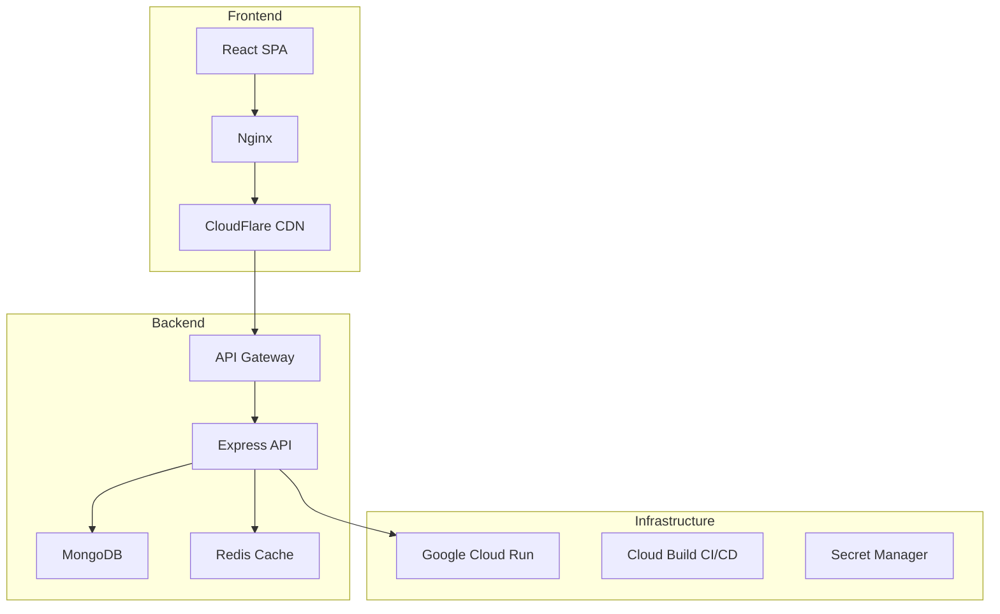

# 🚀 Holded Analysis Platform


Plataforma completa de análisis funcional y replicación de capacidades del ERP Holded.com, con 8 módulos principales y arquitectura enterprise-ready.

## 📋 Tabla de Contenidos

- [Características](#-características)
- [Arquitectura](#-arquitectura)
- [Requisitos](#-requisitos)
- [Instalación](#-instalación)
- [Desarrollo](#-desarrollo)
- [Testing](#-testing)
- [Deployment](#-deployment)
- [API Documentation](#-api-documentation)
- [Contributing](#-contributing)

## ✨ Características

### Frontend
- **React 19** con Vite para desarrollo ultra-rápido
- **Tailwind CSS 4** + shadcn/ui (47 componentes)
- Visualización de datos con **Recharts**
- PWA-ready con service workers
- Internacionalización (i18n) preparada

### Backend
- **Node.js 20** + Express.js
- **MongoDB** con Mongoose ODM
- **Redis** para caché y sesiones
- Autenticación **JWT** con 2FA
- API REST completa con 80+ endpoints

### Módulos ERP
1. **Facturación** - Sistema completo con compliance español
2. **Contabilidad** - Automatización 95% con IA
3. **Proyectos** - Gestión ágil con Kanban/Gantt
4. **Inventario** - Control multialmacén
5. **RRHH** - Gestión integral de equipos
6. **CRM** - Automatización de ventas
7. **TPV** - Terminal punto de venta omnicanal
8. **Sistema** - Administración y configuración

## 🏗️ Arquitectura



## 📦 Requisitos

- Node.js >= 20.0.0
- pnpm >= 8.0.0
- MongoDB >= 7.0
- Redis >= 7.0
- Docker & Docker Compose (opcional)

## 🛠️ Instalación

### 1. Clonar el repositorio
```bash
git clone https://github.com/your-org/holded-analysis.git
cd holded-analysis
```

### 2. Instalar dependencias

#### Frontend
```bash
pnpm install
```

#### Backend
```bash
cd backend
pnpm install
```

### 3. Configurar variables de entorno

#### Frontend
```bash
cp .env.example .env
# Editar .env con tus valores
```

#### Backend
```bash
cd backend
cp .env.example .env
# Editar .env con tus valores
```

### 4. Iniciar servicios con Docker
```bash
docker-compose up -d
```

## 💻 Desarrollo

### Frontend
```bash
# Desarrollo
pnpm dev

# Build producción
pnpm build

# Preview build
pnpm preview
```

### Backend
```bash
cd backend

# Desarrollo
pnpm dev

# Producción
pnpm start

# Migraciones
pnpm run db:migrate

# Seed data
pnpm run db:seed
```

## 🧪 Testing

### Frontend
```bash
# Unit tests
pnpm test

# Coverage
pnpm test:coverage

# E2E tests
pnpm e2e

# E2E con UI
pnpm e2e:ui
```

### Backend
```bash
cd backend

# Unit tests
pnpm test

# Coverage
pnpm test:coverage

# Tests con UI
pnpm test:ui
```

## 🚀 Deployment

### Automático (CI/CD)
El proyecto usa GitHub Actions para CI/CD automático:
- **Push a `develop`** → Deploy a Staging
- **Push a `main`** → Deploy a Production

### Manual

#### Frontend (CloudFlare Pages)
```bash
pnpm build
# Los archivos están en dist/
```

#### Backend (Google Cloud Run)
```bash
# Build imagen
docker build -t holded-backend ./backend

# Push a registry
docker tag holded-backend gcr.io/PROJECT_ID/holded-backend
docker push gcr.io/PROJECT_ID/holded-backend

# Deploy
gcloud run deploy holded-backend \
  --image gcr.io/PROJECT_ID/holded-backend \
  --platform managed \
  --region europe-west1
```

## 📚 API Documentation

La documentación de la API está disponible en:
- **Local**: http://localhost:3000/api-docs
- **Staging**: https://staging-api.holded-analysis.com/api-docs
- **Production**: https://api.holded-analysis.com/api-docs

### Ejemplos de endpoints

```bash
# Autenticación
POST /api/v1/auth/register
POST /api/v1/auth/login

# Módulos
GET /api/v1/modules
GET /api/v1/modules/:id

# Facturas
GET /api/v1/invoices
POST /api/v1/invoices
PUT /api/v1/invoices/:id
```

## 🔒 Seguridad

- **Autenticación**: JWT con refresh tokens
- **2FA**: Autenticación de dos factores
- **Rate Limiting**: Por IP y usuario
- **Helmet.js**: Headers de seguridad
- **CORS**: Configurado para dominios permitidos
- **Validación**: Input sanitization
- **HTTPS**: Obligatorio en producción

## 📊 Monitoreo

- **APM**: Datadog / New Relic
- **Logs**: CloudWatch / Stackdriver
- **Métricas**: Prometheus + Grafana
- **Errores**: Sentry
- **Uptime**: UptimeRobot

## 🤝 Contributing

1. Fork el proyecto
2. Crea tu feature branch (`git checkout -b feature/AmazingFeature`)
3. Commit tus cambios (`git commit -m 'Add some AmazingFeature'`)
4. Push al branch (`git push origin feature/AmazingFeature`)
5. Abre un Pull Request

### Código de Conducta
Por favor lee [CODE_OF_CONDUCT.md](CODE_OF_CONDUCT.md) para detalles sobre nuestro código de conducta.

## 📝 Scripts Útiles

```bash
# Linting
pnpm lint
pnpm lint:fix

# Type checking
pnpm type-check

# Actualizar dependencias
pnpm update --interactive

# Auditoría de seguridad
pnpm audit

# Clean install
rm -rf node_modules pnpm-lock.yaml
pnpm install
```

## 🐳 Docker Commands

```bash
# Build all services
docker-compose build

# Start services
docker-compose up -d

# View logs
docker-compose logs -f

# Stop services
docker-compose down

# Remove volumes
docker-compose down -v
```

## 📈 Performance

- **Lighthouse Score**: 95+
- **Time to Interactive**: <3s
- **First Contentful Paint**: <1s
- **API Response Time**: <200ms p95

## 🌍 Entornos

| Entorno | Frontend | Backend | Docs |
|---------|----------|---------|------|
| Local | http://localhost:5173 | http://localhost:3000 | http://localhost:3000/api-docs |
| Staging | https://staging.holded-analysis.com | https://staging-api.holded-analysis.com | https://staging-api.holded-analysis.com/api-docs |
| Production | https://holded-analysis.com | https://api.holded-analysis.com | https://api.holded-analysis.com/api-docs |

## 📄 Licencia

Este proyecto está licenciado bajo la Licencia MIT - ver el archivo [LICENSE](LICENSE) para más detalles.

## 🙏 Agradecimientos

- [shadcn/ui](https://ui.shadcn.com/) por los componentes UI
- [Radix UI](https://www.radix-ui.com/) por los primitivos accesibles
- [Tailwind CSS](https://tailwindcss.com/) por el sistema de utilidades CSS
- [Vite](https://vitejs.dev/) por la increíble experiencia de desarrollo

---

Desarrollado con ❤️ por el equipo de Holded Analysis